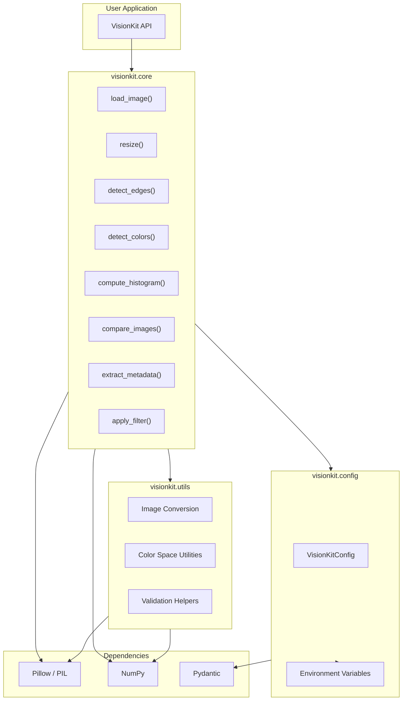

# VisionKit

[](https://github.com/officethree/VisionKit/actions/workflows/ci.yml)
[](https://opensource.org/licenses/MIT)
[](https://www.python.org/downloads/)

**A lightweight object detection and image analysis toolkit for Python.**

Inspired by multimodal AI trends but focused on lightweight computer vision utilities. VisionKit provides simple, composable APIs for image processing, feature detection, and basic computer vision tasks — all powered by Pillow and NumPy.

---

## Architecture



## Features

- **Image Loading** — Load images from local files or URLs
- **Smart Resize** — Resize with automatic aspect ratio preservation
- **Edge Detection** — Sobel operator-based edge detection using NumPy
- **Dominant Colors** — K-means-like clustering for dominant color extraction
- **Histogram Analysis** — Per-channel color histogram computation
- **Image Comparison** — Structural similarity scoring between images
- **Metadata Extraction** — EXIF and basic image metadata parsing
- **Filters** — Blur, sharpen, grayscale, sepia, and more

## Quickstart

### Installation

```bash
pip install -e .
```

### Usage

```python
from visionkit import VisionKit

vk = VisionKit()

# Load and resize an image
img = vk.load_image("photo.jpg")
resized = vk.resize(img, width=800)

# Detect edges
edges = vk.detect_edges(img, threshold=50)

# Find dominant colors
colors = vk.detect_colors(img, n_colors=5)
# => [(255, 120, 80), (30, 60, 200), ...]

# Compute color histogram
histogram = vk.compute_histogram(img)

# Compare two images
score = vk.compare_images(img, resized)
# => 0.87 (similarity from 0.0 to 1.0)

# Extract metadata
meta = vk.extract_metadata(img)

# Apply filters
blurred = vk.apply_filter(img, filter_type="blur")
sharp = vk.apply_filter(img, filter_type="sharpen")
gray = vk.apply_filter(img, filter_type="grayscale")
```

## Development

```bash
# Install dev dependencies
pip install -e ".[dev]"

# Run tests
make test

# Lint
make lint

# Format
make format
```

## Configuration

Set environment variables or create a `.env` file:

| Variable         | Default | Description                     |
|------------------|---------|---------------------------------|
| `LOG_LEVEL`      | `INFO`  | Logging verbosity               |
| `MAX_IMAGE_SIZE` | `4096`  | Max dimension in pixels allowed |

## License

MIT License. See [LICENSE](LICENSE) for details.

---

Built by **Officethree Technologies** | Made with ❤️ and AI
